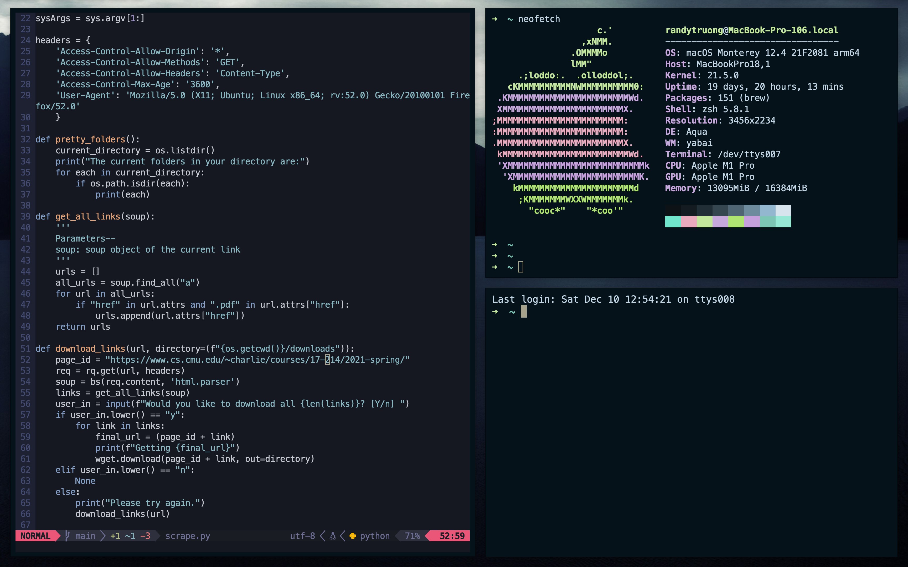
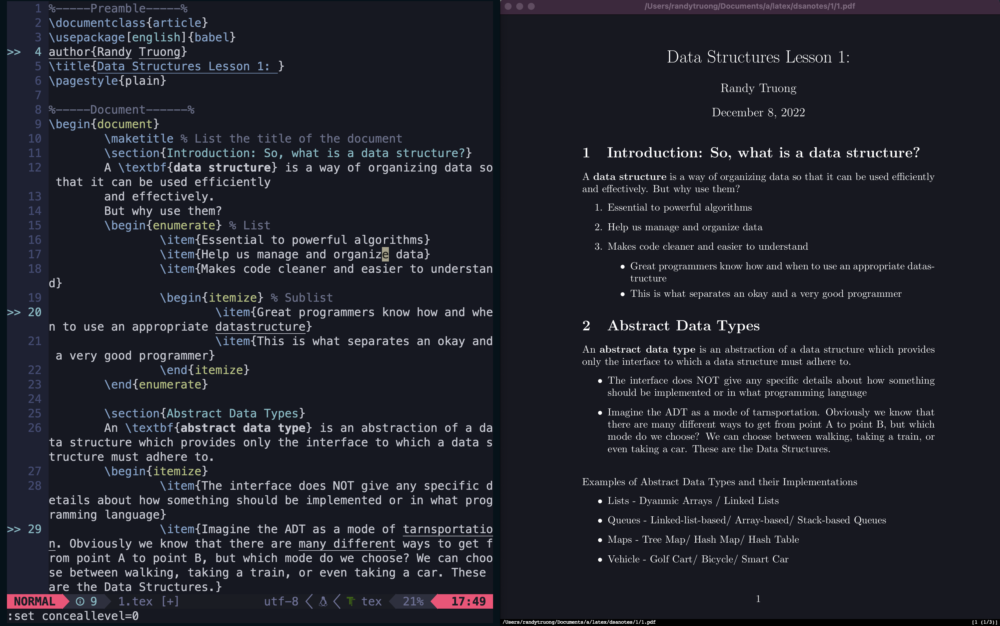

# Northwestern Setup 2022 :grimacing:...

**Yes, this is unfortunately how I actually use my computer whenever I am trying to take notes/code.**

This is the current configuration that I have for alacritty, yabai/skhdrc, and neovim. I'll eventually add my zsh plugins, but this is all for now. I eventually plan on moving to emacs but I've already lost enough of my life to Vim...

# My Workflow Essentials

My current alacritty theme is custom. 

My current nvim theme is [iceberg](https://github.com/cocopon/iceberg.vim)

## For Terminal Usage: 
1. [yabai](https://github.com/koekeishiya/yabai) (window manager in the style of binary split panes)
2. Neovim (Vim, but better)
3. [neofetch](https://github.com/dylanaraps/neofetch) (*aesthetic* specs list)
4. [glow](https://github.com/charmbracelet/glow)(*aesthetic* markdown viewer in terminal)
5. [zathura](https://github.com/pwmt/zathura) (PDF viewer with Vim-like controls)

## For Notetaking (by Importance): 
1. [limelight.vim](https://github.com/junegunn/limelight.vim) (adds paragraph highlighting to Vim)
2. [goyo.vim](https://github.com/junegunn/goyo.vim) (adds a *focus* mode to Vim)
3. [vim-pencil](https://github.com/preservim/vim-pencil) (adds Word-like text wrapping)

## Notetaking example 

Credits:
skhdrc and yabai setup from @julian-heng
